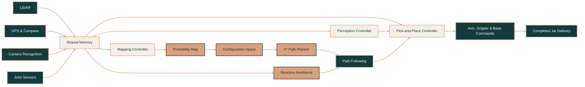
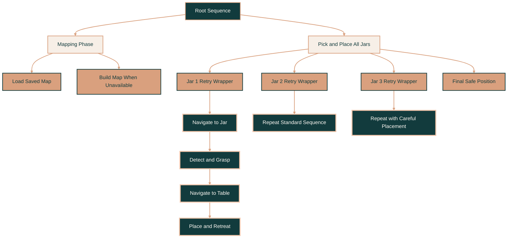

<div id="top"></div>

<br>

[](https://github.com/soph-k)
[](https://www.python.org/)
[](./LICENSE)
[](https://github.com/soph-k/tiago-mapping-planning/commits/main)
[](https://github.com/soph-k/tiago-mapping-planning)

<br>

<!-- Header -->

<div align="center">

<a href="https://github.com/soph-k">
  
</a>

<h2>『 TIAGo Autonomous Mobile Manipulation 』</h2>

<p>
  An integrated Webots robotics system combining LiDAR mapping, A* navigation,
  reactive obstacle avoidance, camera perception, and multi-object pick-and-place.
</p>

<p>────── ♡ ──────</p>

<p>
  <a href="./final/controllers/main">
    <strong>View Final Controller »</strong>
  </a>
  &nbsp; • &nbsp;
  <a href="./final/worlds/kitchen.wbt">
    <strong>Open Webots World »</strong>
  </a>
</p>

</div>

<br>

<p align="center">
  
</p>

<br>

<!-- Table of Contents -->

## ❐ Table of Contents

<details>
<summary><strong>Quick Links</strong></summary>

<ol>
  <li><a href="#about-the-project">About the Project</a></li>
  <li><a href="#mission-snapshot">Mission Snapshot</a></li>
  <li><a href="#project-preview">Project Preview</a></li>
  <li><a href="#core-capabilities">Core Capabilities</a></li>
  <li><a href="#system-architecture">System Architecture</a></li>
  <li><a href="#mission-execution">Mission Execution</a></li>
  <li><a href="#behavior-tree">Behavior Tree</a></li>
  <li><a href="#configuration-space">Configuration Space</a></li>
  <li><a href="#implementation">Implementation</a></li>
  <li><a href="#key-parameters">Key Parameters</a></li>
  <li><a href="#project-status">Project Status</a></li>
  <li><a href="#built-with">Built With</a></li>
  <li><a href="#repository-structure">Repository Structure</a></li>
  <li><a href="#getting-started">Getting Started</a></li>
  <li><a href="#future-improvements">Future Improvements</a></li>
  <li><a href="#license">License</a></li>
  <li><a href="#acknowledgments">Acknowledgments</a></li>
</ol>

</details>

<br>

<!-- About -->

<div id="about-the-project"></div>

## ❐ About the Project

This project implements an autonomous mobile-manipulation system for the
**TIAGo robot** inside a simulated Webots kitchen.

The final controller coordinates mapping, navigation, perception, and manipulation
so the robot can:

- Build a probabilistic occupancy-grid map from LiDAR readings
- Generate an inflated configuration space for safer navigation
- Plan collision-aware routes using A*
- Follow planned paths while reacting to nearby obstacles
- Recognize objects through the Webots camera interface
- Navigate to three predefined jar locations
- Pick up each jar and transport it to a table
- Complete the full mission through hierarchical behavior trees
- Save and reload map data between simulation runs

The main challenge was not implementing one algorithm independently. It was making
several asynchronous robotic subsystems behave reliably inside one continuously
running control loop.

> **Project focus:** integrating mapping, planning, perception, navigation, and
> manipulation into one complete autonomous robotics pipeline.

<p align="right">(<a href="#top">back to top</a>)</p>

<br>

<!-- Mission Snapshot -->

<div id="mission-snapshot"></div>

## ❐ Mission Snapshot

<table width="100%">
<tr>

<td align="center" width="25%" valign="top">

<h3>01</h3>

<strong>MAP</strong>

<br><br>

<sub>
Explore the kitchen and construct a probabilistic occupancy grid from LiDAR data.
</sub>

</td>

<td align="center" width="25%" valign="top">

<h3>02</h3>

<strong>PLAN</strong>

<br><br>

<sub>
Inflate obstacles and calculate collision-aware routes through the environment.
</sub>

</td>

<td align="center" width="25%" valign="top">

<h3>03</h3>

<strong>PERCEIVE</strong>

<br><br>

<sub>
Recognize jars through the camera and share their locations with the task controller.
</sub>

</td>

<td align="center" width="25%" valign="top">

<h3>04</h3>

<strong>DELIVER</strong>

<br><br>

<sub>
Pick up three jars, transport them to the table, and place each one safely.
</sub>

</td>

</tr>
</table>

<br>

<p align="center">


</p>

<p align="center">
  <sub>One robot • Four coordinated stages • One complete autonomous mission</sub>
</p>

<p align="right">(<a href="#top">back to top</a>)</p>

<br>

<!-- Project Preview -->

<div id="project-preview"></div>

## ❐ Project Preview

<p align="center">
  
</p>

<p align="center">
  <sub>
    Webots kitchen simulation showing TIAGo navigation,
    planned movement, and camera-recognition output
  </sub>
</p>

<br>

<table width="100%">
<tr>
<td width="50%" valign="top">

### What the robot sees

- Camera-recognized objects
- Jar locations
- Table and kitchen objects
- Robot-relative object positions
- World-coordinate transformations

</td>

<td width="50%" valign="top">

### What the robot tracks

- Current pose and heading
- Occupancy-grid updates
- Planned path waypoints
- LiDAR obstacle sectors
- Jar and task completion state

</td>
</tr>
</table>

<p align="right">(<a href="#top">back to top</a>)</p>

<br>

<!-- Core Capabilities -->

<div id="core-capabilities"></div>

## ❐ Core Capabilities

| Subsystem | Responsibility |
|---|---|
| **Mapping** | Builds a probabilistic occupancy grid from LiDAR measurements |
| **Configuration Space** | Inflates detected obstacles to account for robot size and safety margins |
| **Path Planning** | Generates collision-aware A* routes across the configuration space |
| **Navigation** | Follows planned waypoints while correcting heading and monitoring obstacles |
| **Reactive Avoidance** | Adjusts wheel commands using front and side LiDAR sectors |
| **Perception** | Detects objects and transforms camera coordinates into world coordinates |
| **Manipulation** | Coordinates the mobile base, torso, arm, gripper, and placement sequence |
| **Task Planning** | Uses behavior trees to manage mission order, retries, and completion |
| **Visualization** | Displays maps, paths, targets, robot pose, and trajectory history |
| **Persistence** | Saves and reloads the probability map, C-space, and coordinate metadata |

<p align="right">(<a href="#top">back to top</a>)</p>

<br>

<!-- System Architecture -->

<div id="system-architecture"></div>

## ❐ System Architecture



### Shared-System Design

The controller uses a shared memory board so individual modules can exchange:

- Device references
- Robot pose and heading
- Current navigation target
- Probability and configuration-space maps
- Planned paths
- Camera-recognized objects
- Mapping and manipulation status
- Jar completion state

This allows each subsystem to remain separate while still contributing to one
coordinated mission.

<p align="right">(<a href="#top">back to top</a>)</p>

<br>

<!-- Mission Execution -->

<div id="mission-execution"></div>

## ❐ Mission Execution

```mermaid
flowchart LR
    A["Initialize Devices"] --> B["Check Saved Map"]

    B --> C["Load Existing Map"]
    B --> D["Build New Map"]

    D --> E["Generate C-Space"]
    C --> F["Begin Manipulation"]
    E --> F

    F --> G["Jar 1 Sequence"]
    G --> H["Jar 2 Sequence"]
    H --> I["Jar 3 Sequence"]

    I --> J["Final Safe Pose"]
    J --> K["Mission Complete"]

    classDef teal fill:#123b3d,stroke:#d9a07e,color:#fffaf4,stroke-width:2px;
    classDef cream fill:#f7efe7,stroke:#d9a07e,color:#123b3d,stroke-width:2px;
    classDef rose fill:#d9a07e,stroke:#123b3d,color:#123b3d,stroke-width:2px;
    classDef final fill:#123b3d,stroke:#f2c5aa,color:#fffaf4,stroke-width:3px;

    class A,B teal;
    class C,D,E cream;
    class F,G,H,I rose;
    class J,K final;

    linkStyle default stroke:#d9a07e,stroke-width:2px;
```



### Mission Stages

1. Initialize the Webots robot and required devices
2. Create the navigation, perception, display, and manipulation controllers
3. Load a valid saved map when available
4. Otherwise, navigate through mapping waypoints and build a new map
5. Generate the configuration space
6. Begin the jar pick-and-place phase
7. Run each jar sequence with retry support
8. Place the third jar using slower, more careful handling
9. Return the arm to its final safe pose
10. Stop after the root behavior tree reports success

<p align="right">(<a href="#top">back to top</a>)</p>

<br>

<!-- Behavior Tree -->

<div id="behavior-tree"></div>

## ❐ Behavior Tree



Each jar task contains a coordinated sequence of actions:

```text
Safe Arm Pose
      ↓
Rotate Toward Jar
      ↓
Navigate to Pickup Area
      ↓
Confirm Detection or Proximity
      ↓
Approach and Grasp
      ↓
Retreat into Carrying Pose
      ↓
Compute Table Standoff Point
      ↓
Navigate to Drop-Off Area
      ↓
Place Jar and Retreat
      ↓
Mark Jar Complete
```

Each jar sequence is wrapped in retry logic. The third jar uses reduced speed and
additional settling time during placement for improved stability.

<p align="right">(<a href="#top">back to top</a>)</p>

<br>

<!-- Configuration Space -->

<div id="configuration-space"></div>

## ❐ Configuration Space

<p align="center">
  
</p>

<p align="center">
  <sub>
    Configuration space used by the A* planner for collision-aware navigation
  </sub>
</p>

The configuration space is generated from the probability map by thresholding
detected obstacles and inflating their occupied regions.

| Map Value | Meaning |
|---|---|
| **White cells** | Traversable navigation space |
| **Black cells** | Obstacles or inflated safety boundaries |
| **Saved metadata** | Origin, resolution, dimensions, axis direction, and creation time |

The controller validates loaded maps and their coordinate metadata before using
them. If alignment validation fails, it can attempt to regenerate the C-space
using the current coordinate transforms.

<p align="right">(<a href="#top">back to top</a>)</p>

<br>

<!-- Implementation -->

<div id="implementation"></div>

## ❐ Implementation

### Main Modules

| Module | Responsibility |
|---|---|
| `main.py` | Device initialization, controller setup, root behavior tree, and control loop |
| `config.py` | Map geometry, speeds, waypoints, jar positions, and drop-off locations |
| `navigation.py` | Mapping, map persistence, C-space generation, A*, path following, and avoidance |
| `planning.py` | Three-jar behavior-tree construction, retry logic, and task execution |
| `camera.py` | Object recognition and camera-to-world coordinate conversion |
| `arms.py` | Arm poses, torso movement, gripper control, pickup, placement, and recovery |
| `display.py` | Probability map, C-space, trajectory, route, and target visualization |
| `utils.py` | Shared memory, devices, coordinate transforms, timing, and helper functions |

### Mapping

- Reads forward LiDAR measurements
- Filters invalid and out-of-range values
- Transforms LiDAR points from robot coordinates into world coordinates
- Converts world coordinates into grid cells
- Accumulates weighted obstacle evidence
- Records the robot trajectory
- Saves probability maps, configuration-space maps, and metadata

### Navigation

- Finds safe start and goal cells
- Calculates A* paths across the C-space
- Converts path cells back into world coordinates
- Follows planned waypoints
- Corrects heading using proportional control
- Uses direct-goal fallback behavior when a valid path cannot be recovered
- Applies reduced movement speed when using a loaded map

### Reactive Avoidance

The controller divides LiDAR readings into five sectors:

```text
Left Side | Front Left | Front Center | Front Right | Right Side
```

It can then:

- Stop when the center path is blocked
- Turn away from one-sided obstacles
- Bias wheel commands away from side obstacles
- Relax side avoidance when close and aligned with a goal
- Apply a hard stop when an object is extremely close

### Manipulation

- Uses predefined arm poses for navigation, pickup, carrying, and placement
- Coordinates torso, arm, gripper, and mobile-base movement
- Computes standoff positions near the table
- Uses contact-oriented movement during final placement
- Adds retry wrappers around each jar sequence
- Uses careful low-speed placement for the third jar

<p align="right">(<a href="#top">back to top</a>)</p>

<br>

<!-- Key Parameters -->

<div id="key-parameters"></div>

## ❐ Key Parameters

### Map and Navigation

| Parameter | Value |
|---|---:|
| Grid width | `200 cells` |
| Grid height | `300 cells` |
| Resolution | `0.025 m/pixel` |
| Physical width | `5.0 m` |
| Physical height | `7.5 m` |
| Goal tolerance | `0.4 m` |
| Mapping waypoints | `16` |
| Mapping time limit | `90 seconds` |
| Reactive avoidance | `Enabled` |

### Motion and Manipulation

| Parameter | Value |
|---|---:|
| Maximum turn speed | `4.0` |
| Maximum drive speed | `3.0` |
| General arm speed | `0.3` |
| Torso speed | `0.05` |
| Gripper speed | `0.05` |
| Jar pickup locations | `3` |
| Drop-off locations | `3` |
| Retry limit | `2 failures per jar` |

The main project settings are defined in:

```text
final/controllers/main/config.py
```

<p align="right">(<a href="#top">back to top</a>)</p>

<br>

<!-- Project Status -->

<div id="project-status"></div>

## ❐ Project Status

| Capability | Status |
|---|---|
| Probabilistic LiDAR mapping | **Implemented** |
| Configuration-space generation | **Implemented** |
| Map saving and reloading | **Implemented** |
| A* navigation | **Implemented** |
| Reactive obstacle avoidance | **Implemented** |
| Camera-based object recognition | **Implemented** |
| Pick and place one jar | **Complete** |
| Pick and place three jars | **Complete** |
| Behavior-tree orchestration | **Implemented** |
| Per-jar retry logic | **Implemented** |
| Advanced inverse kinematics | **Not implemented** |
| Cereal-box manipulation | **Not implemented** |
| Dynamic global-map updates | **Future improvement** |

<p align="right">(<a href="#top">back to top</a>)</p>

<br>

<!-- Built With -->

<div id="built-with"></div>

## ❐ Built With


<p align="center">
  <sub>
    Robotics • Mapping • Path Planning • Perception • Behavior Trees • Mobile Manipulation
  </sub>
</p>

<p align="right">(<a href="#top">back to top</a>)</p>

<br>

<!-- Repository Structure -->

<div id="repository-structure"></div>

## ❐ Repository Structure

```text
tiago-mapping-planning/
├── .github/
│   └── workflows/
│
├── assets/
│   ├── images/
│   │   └── logo.png
│   └── scripts/
│
├── final/
│   ├── assets/
│   │   └── images/
│   │       ├── cspace.png
│   │       ├── preview.jpg
│   │       └── preview_demo.jpg
│   │
│   ├── controllers/
│   │   └── main/
│   │       ├── arms.py
│   │       ├── camera.py
│   │       ├── config.py
│   │       ├── display.py
│   │       ├── main.py
│   │       ├── navigation.py
│   │       ├── planning.py
│   │       └── utils.py
│   │
│   ├── worlds/
│   │   └── kitchen.wbt
│   │
│   ├── LICENSE
│   └── README.md
│
├── mapping-planning/
│   └── Earlier mapping and navigation implementation
│
├── LICENSE
└── README.md
```

The `final/` directory contains the complete mobile-manipulation system. The
`mapping-planning/` directory preserves the earlier navigation-focused version.

<p align="right">(<a href="#top">back to top</a>)</p>

<br>

<!-- Getting Started -->

<div id="getting-started"></div>

## ▹ Getting Started

### ❐ Prerequisites

Make sure you have:

- Webots installed
- Python 3.8 or newer
- Git
- A Python interpreter configured in Webots

### ❐ Installation

Clone the repository:

```sh
git clone https://github.com/soph-k/tiago-mapping-planning.git
cd tiago-mapping-planning
```

Create a virtual environment:

```sh
python -m venv .venv
```

Activate it on Windows:

```powershell
.venv\Scripts\Activate.ps1
```

Activate it on macOS or Linux:

```sh
source .venv/bin/activate
```

Install the required packages:

```sh
pip install numpy scipy pillow py-trees
```

### ❐ Configure Webots

In Webots:

1. Open **Tools → Preferences → Python command**
2. Select the Python executable from your environment
3. Open:

```text
final/worlds/kitchen.wbt
```

4. Select the TIAGo robot
5. Confirm that the robot controller is:

```text
main
```

6. Press **Run**

When valid saved map files are available, the controller loads them before the
manipulation phase. Otherwise, it performs the mapping phase first.

<p align="right">(<a href="#top">back to top</a>)</p>

<br>

<!-- Future Improvements -->

<div id="future-improvements"></div>

## ❐ Future Improvements

1. **Inverse kinematics**  
   Calculate arm poses dynamically rather than relying mainly on predefined joint positions.

2. **Dynamic replanning**  
   Update routes when obstacles move after the initial map has been generated.

3. **Additional object types**  
   Support larger, irregular, or non-prehensile objects such as cereal boxes.

4. **Generalized object locations**  
   Reduce reliance on predefined pickup and drop-off coordinates.

5. **Automated testing**  
   Add tests for coordinate transforms, path planning, map loading, and behavior nodes.

6. **Mission logging**  
   Save task timing, retry counts, path lengths, and success metrics for later analysis.

7. **Multi-robot coordination**  
   Extend the behavior architecture to collaborative mapping or manipulation tasks.

<p align="right">(<a href="#top">back to top</a>)</p>

<br>

<!-- License -->

<div id="license"></div>

## ▹ License

Distributed under the MIT License. See [`LICENSE`](./LICENSE) for details.

<p align="right">(<a href="#top">back to top</a>)</p>

<br>

<!-- Acknowledgments -->

<div id="acknowledgments"></div>

## ▹ Acknowledgments

- [Cyberbotics](https://cyberbotics.com/) for the Webots simulation platform
- [PAL Robotics](https://pal-robotics.com/) for the TIAGo robot platform
- [`py_trees`](https://py-trees.readthedocs.io/) for behavior-tree orchestration
- NumPy, SciPy, and Pillow for numerical and image-processing utilities
- Claude AI was used as a debugging aid for a C-space map-loading and metadata issue; the result was reviewed, adapted, and integrated by Soph


<br>

<div align="center">

<p>────── ♡ ──────</p>

<p><strong>TIAGo Mission Complete</strong></p>

<sub>✦ Map thoughtfully • Plan safely • Move autonomously ✦</sub>

</div>

<p align="right">(<a href="#top">back to top</a>)</p>