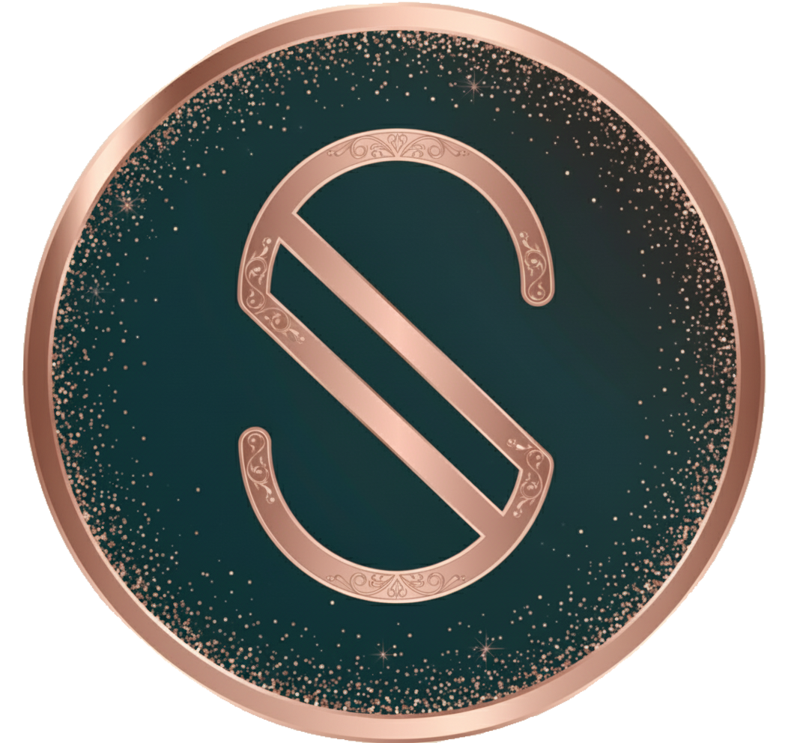
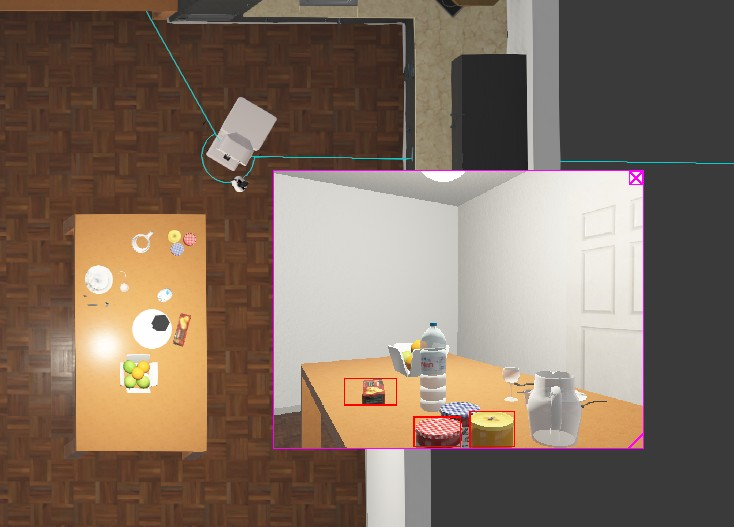
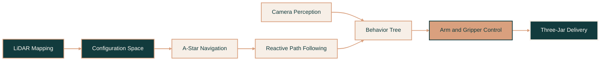
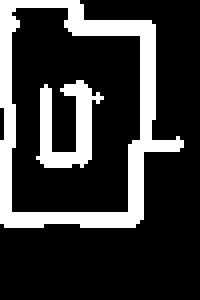

<div id="top"></div>

<br>

<!-- Header Badges -->

<p align="center">
  <a href="https://github.com/soph-k">
    
  </a>
  <a href="https://www.python.org/">
    
  </a>
  <a href="./LICENSE">
    
  </a>
  <a href="https://github.com/soph-k/tiago-mapping-planning/commits/main">
    
  </a>
  <a href="https://github.com/soph-k/tiago-mapping-planning">
    
  </a>
</p>

<br>

<!-- Header -->

<div align="center">

<a href="https://github.com/soph-k">
  
</a>

<h2>『 TIAGo Autonomous Mobile Manipulation 』</h2>

<p>
  An integrated Webots robotics system combining LiDAR mapping, A* navigation,
  reactive obstacle avoidance, camera perception, and multi-object pick-and-place.
</p>

<p>────── ♡ ──────</p>

<p>
  <a href="./controllers/main">
    <strong>View Controller »</strong>
  </a>
</p>

</div>

<br>

<!-- Real Project Image -->

<p align="center">
  <a href="./assets/images/preview_demo.jpg">
    
  </a>
</p>

<p align="center">
  <sub>
    Webots kitchen simulation showing TIAGo navigation,
    planned movement, and camera-recognition output
  </sub>
</p>

<br>

<!-- Table of Contents -->

## ❐ Table of Contents

<details>
<summary><strong>Quick Links</strong></summary>

<ol>
  <li><a href="#about-the-project">About the Project</a></li>
  <li><a href="#project-highlights">Project Highlights</a></li>
  <li><a href="#project-preview">Project Preview</a></li>
  <li><a href="#system-architecture">System Architecture</a></li>
  <li><a href="#how-it-works">How It Works</a></li>
  <li><a href="#implementation">Implementation</a></li>
  <li><a href="#built-with">Built With</a></li>
  <li><a href="#repository-structure">Repository Structure</a></li>
  <li><a href="#getting-started">Getting Started</a></li>
  <li><a href="#future-improvements">Future Improvements</a></li>
  <li><a href="#license">License</a></li>
  <li><a href="#acknowledgments">Acknowledgments</a></li>
</ol>

</details>

<br>

<!-- About -->

<div id="about-the-project"></div>

## ❐ About the Project

This project implements an autonomous mobile-manipulation system for the
**TIAGo robot** inside a simulated Webots kitchen.

The controller coordinates mapping, navigation, perception, and manipulation
so the robot can:

- Build a probabilistic occupancy-grid map from LiDAR measurements
- Generate an inflated configuration space for collision-aware navigation
- Plan routes through the environment using A*
- Follow planned paths while reacting to nearby obstacles
- Recognize objects through the Webots camera interface
- Transform detected object positions into world coordinates
- Pick up three jars and transport them to a table
- Complete the mission using hierarchical behavior trees
- Save and reload map data between simulation runs

The main challenge was not implementing one individual algorithm. It was making
mapping, planning, perception, base movement, arm control, and task execution
work reliably inside one continuously running robotics system.

> **Project focus:** integrating several asynchronous robotic subsystems into one
> complete and dependable autonomous mission.

<p align="right">(<a href="#top">back to top</a>)</p>

<br>

<!-- Project Highlights -->

<div id="project-highlights"></div>

## ❐ Project Highlights

<table width="100%">
<tr>

<td width="50%" valign="top">

### Autonomous Navigation

- Probabilistic LiDAR mapping
- Configuration-space inflation
- A* path planning
- Reactive obstacle avoidance
- Map storage and reuse
- Real-time trajectory visualization

</td>

<td width="50%" valign="top">

### Mobile Manipulation

- Camera-based object recognition
- Three-jar pickup and delivery
- Coordinated base, torso, arm, and gripper control
- Behavior-tree orchestration
- Retry and recovery logic
- Careful final placement behavior

</td>

</tr>
</table>

<br>

<p align="center">
  
  
  
</p>

<p align="center">
  
  
  
</p>

<p align="right">(<a href="#top">back to top</a>)</p>

<br>

<!-- Project Preview -->

<div id="project-preview"></div>

## ❐ Project Preview

<table width="100%">
<tr>

<td width="62%" align="center" valign="middle">

<a href="./assets/images/preview_demo.jpg">
  
</a>

<br>

<sub>Navigation and camera-recognition view</sub>

</td>

</tr>
</table>

<br>

<table width="100%">
<tr>

<td width="50%" valign="top">

### What TIAGo perceives

- Camera-recognized objects
- Jar positions
- Robot-relative object locations
- World-coordinate object positions
- Nearby LiDAR obstacles

</td>

<td width="50%" valign="top">

### What TIAGo tracks

- Current position and heading
- Probabilistic map updates
- Planned navigation waypoints
- Robot trajectory
- Jar and mission completion state

</td>

</tr>
</table>

<p align="right">(<a href="#top">back to top</a>)</p>

<br>

<!-- Architecture -->

<div id="system-architecture"></div>

## ❐ System Architecture



### Data Flow

| Input | Processing | Output |
|---|---|---|
| **LiDAR** | Probabilistic mapping and obstacle inflation | Occupancy map and configuration space |
| **GPS and compass** | Position and heading estimation | Robot pose in world coordinates |
| **Camera recognition** | Detection and coordinate transformation | Recognized jar locations |
| **Configuration space** | A* path planning | Collision-aware navigation route |
| **Behavior-tree state** | Task sequencing and retry logic | Complete three-jar delivery |

<p align="right">(<a href="#top">back to top</a>)</p>

<br>

<!-- How It Works -->

<div id="how-it-works"></div>

## ❐ How It Works

### 01 — Map

TIAGo explores the kitchen and builds a probabilistic occupancy grid from
LiDAR measurements. The resulting map can be saved and reused in later runs.

### 02 — Plan

Detected obstacles are inflated into a configuration space that accounts for
the robot's dimensions and safety margin. A* then calculates a collision-aware route.

### 03 — Perceive

The camera recognizes objects and transforms their detected positions from the
camera frame into world coordinates.

### 04 — Manipulate

A behavior tree coordinates navigation, grasping, transportation, placement,
retry logic, and final task completion for all three jars.

<br>

<details>
<summary><strong>View detailed behavior-tree sequence</strong></summary>

<br>

```text
Load or Build Map
        ↓
Generate Configuration Space
        ↓
Navigate to Jar
        ↓
Confirm Object Detection
        ↓
Approach and Grasp
        ↓
Retreat into Carrying Pose
        ↓
Navigate to Table
        ↓
Place and Release
        ↓
Repeat for Remaining Jars
        ↓
Return to Final Safe Pose
```

Each jar task is wrapped in retry logic so a temporary navigation,
perception, or manipulation failure does not immediately stop the mission.

</details>

<br>

### Configuration Space

<p align="center">
  <a href="./assets/images/cspace.png">
    
  </a>
</p>

<p align="center">
  <sub>
    Configuration space used by the A* planner for collision-aware navigation
  </sub>
</p>

| Region | Meaning |
|---|---|
| **Black regions** | Navigable areas available to the robot |
| **White regions** | Obstacles and inflated safety boundaries |
| **Saved metadata** | Map origin, resolution, dimensions, and coordinate settings |

<p align="right">(<a href="#top">back to top</a>)</p>

<br>

<!-- Implementation -->

<div id="implementation"></div>

## ❐ Implementation

| Module | Responsibility |
|---|---|
| `main.py` | Device initialization, subsystem setup, root behavior tree, and control loop |
| `config.py` | Map dimensions, motion speeds, waypoints, jar positions, and drop-off points |
| `navigation.py` | Mapping, map persistence, C-space generation, A*, path following, and avoidance |
| `planning.py` | Three-jar behavior-tree construction and retry logic |
| `camera.py` | Object recognition and camera-to-world coordinate transformation |
| `arms.py` | Arm poses, torso movement, gripper control, pickup, placement, and recovery |
| `display.py` | Map, route, target, pose, and trajectory visualization |
| `utils.py` | Shared state, coordinate transformations, timing, and helper functions |

<details>
<summary><strong>View important project parameters</strong></summary>

<br>

| Parameter | Value |
|---|---:|
| Grid size | `200 × 300 cells` |
| Resolution | `0.025 m/pixel` |
| Physical map size | `5.0 × 7.5 m` |
| Goal tolerance | `0.4 m` |
| Maximum drive speed | `3.0` |
| Maximum turning speed | `4.0` |
| General arm speed | `0.3` |
| Torso speed | `0.05` |
| Gripper speed | `0.05` |
| Jar pickup positions | `3` |
| Table drop-off positions | `3` |

The primary configuration values are located in:

```text
controllers/main/config.py
```

</details>

<p align="right">(<a href="#top">back to top</a>)</p>

<br>

<!-- Built With -->

<div id="built-with"></div>

## ❐ Built With

<p align="center">
  
  
  
  
</p>

<p align="center">
  
  
  
</p>

<p align="center">
  <sub>
    Robotics • Mapping • Path Planning • Perception • Behavior Trees • Mobile Manipulation
  </sub>
</p>

<p align="right">(<a href="#top">back to top</a>)</p>

<br>

<!-- Repository Structure -->

<div id="repository-structure"></div>

## ❐ Repository Structure

```text
tiago-mapping-planning/
├── .github/
│   └── workflows/
│
├── assets/
│   └── images/
│       ├── cspace.png
│       ├── logo.png
│       ├── preview.jpg
│       └── preview_demo.jpg
│
├── controllers/
│   └── main/
│       ├── arms.py
│       ├── camera.py
│       ├── config.py
│       ├── display.py
│       ├── main.py
│       ├── navigation.py
│       ├── planning.py
│       └── utils.py
│
├── legacy/
│   └── mapping-navigation/
│       └── Earlier mapping and navigation implementation
│
├── worlds/
│   └── kitchen.wbt
│
├── requirements.txt
├── LICENSE
└── README.md
```

### Generated Map Files

The controller creates reusable map files during execution:

```text
map/
├── cspace.npy
├── prob_map.npy
└── cspace_metadata.json
```

<p align="right">(<a href="#top">back to top</a>)</p>

<br>

<!-- Getting Started -->

<div id="getting-started"></div>

## ▹ Getting Started

### ❐ Prerequisites

Make sure you have:

- Webots installed
- Python 3.8 or newer
- Git
- A Python interpreter configured in Webots

### ❐ Installation

Clone the repository:

```sh
git clone https://github.com/soph-k/tiago-mapping-planning.git
cd tiago-mapping-planning
```

Create a virtual environment:

```sh
python -m venv .venv
```

Activate it on Windows:

```powershell
.venv\Scripts\Activate.ps1
```

Activate it on macOS or Linux:

```sh
source .venv/bin/activate
```

Install the required packages:

```sh
pip install -r requirements.txt
```

Or install them directly:

```sh
pip install numpy scipy pillow py-trees
```

### ❐ Run in Webots

1. Open **Tools → Preferences → Python command**
2. Select the Python executable from your environment
3. Open:

```text
worlds/kitchen.wbt
```

4. Select the TIAGo robot
5. Confirm that the controller field is:

```text
main
```

6. Press **Run**

When valid saved map files are available, the controller loads them and proceeds
to the manipulation phase. Otherwise, TIAGo performs the mapping phase first.

<p align="right">(<a href="#top">back to top</a>)</p>

<br>

<!-- Future Improvements -->

<div id="future-improvements"></div>

## ❐ Future Improvements

- Add inverse kinematics for dynamically calculated arm poses
- Replan routes when obstacles move after the original map is generated
- Support larger or irregular objects such as cereal boxes
- Reduce reliance on predefined pickup and drop-off coordinates
- Add automated tests for coordinate transforms and path planning
- Record task duration, path length, retry counts, and success rates
- Extend the behavior architecture to multi-robot tasks

<p align="right">(<a href="#top">back to top</a>)</p>

<br>

<!-- License -->

<div id="license"></div>

## ▹ License

Distributed under the MIT License. See [`LICENSE`](./LICENSE) for details.

<p align="right">(<a href="#top">back to top</a>)</p>

<br>

<!-- Acknowledgments -->

<div id="acknowledgments"></div>

## ▹ Acknowledgments

- [Cyberbotics](https://cyberbotics.com/) for the Webots simulation platform
- [PAL Robotics](https://pal-robotics.com/) for the TIAGo robot platform
- [`py_trees`](https://py-trees.readthedocs.io/) for behavior-tree orchestration
- NumPy, SciPy, and Pillow for numerical and image-processing utilities
- Claude AI was used as a debugging aid for a C-space map-loading and metadata issue; the result was reviewed, adapted, and integrated by Soph


<br>

<div align="center">

<p>────── ♡ ──────</p>

<p><strong>TIAGo Mission Complete</strong></p>

<sub>✦ Map thoughtfully • Plan safely • Move autonomously ✦</sub>

</div>

<p align="right">(<a href="#top">back to top</a>)</p>