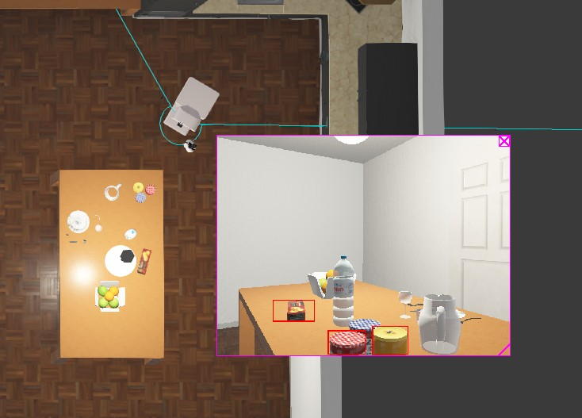

# Webots: TIAGo Autonomous Mobile Manipulation System

[](https://github.com/soph-k)
[](https://github.com/soph-k/tiago-mapping-planning/blob/main/LICENSE)
[](https://github.com/soph-k/tiago-mapping-planning/commits)

Autonomous manipulation system: SLAM mapping, A* navigation, object perception, and multi-jar pick-and-place with behavior trees.

----


---

## Overview

An integrated Webots controller for TIAGo robot that performs:

- **Mapping**: Builds 2D occupancy map from Lidar with Cspace inflation
- **Navigation**: A* path planning with Jump Point Search and reactive avoidance  
- **Perception**: Camera based object recognition
- **Manipulation**: Multistage pick anplace for 3 jars
- **Orchestration**: Hierarchical behavior trees managing all subsystems

---

## Features

### Core 
- Lidar based SLAM with probabilistic occupancy grids
- Configuration space generation with safety inflation
- A*/JPS path planning 
- Reactive obstacle avoidance using Lidar
- Coordinated arm-base manipulation
- Map storage and reuse

### Implementation
- World to Grid coordinate transforms (200×300 grid)
- Distance transform obstacle inflation
- Behavior tree managment with py_trees
- Multi phase task execution (map  pick  place)
- Real time visualization on Webots Display

---

## Built With

- Webots 
- Python 3.8+
- NumPy & SciPy
- PIL 
- py_trees 

---

## Quickstart

### Prerequisites

- Webots installed  
- Python 3.8+ configured in Webots
- Required packages:
```bash
pip install numpy scipy pillow py-trees
```

### Installation
```bash
git clone https://github.com/soph-k/tiago-mapping-planning/tree/main/final
```

### Run

1. Open kitchen.wbt world in Webots
2. Set robot controller to `main.py`
3. Press Run

---

## Project Structure
```
# Core System
main.py           # Entry point, system initialization
config.py         # Robot parameters, positions, waypoints

# Navigation & Mapping
navigation.py     # SLAM, path planning, reactive avoidance
mapping.py        # LiDAR mapping, C-space 
planning.py       # Pick place controller, behavior trees

# Subsystems
camera.py         # Vision based perception
arms.py           # Arm control, gripper behaviors
display.py        # Visualization manager
utils.py          # Shared utilities, transforms

# Assets
maps/            # Saved maps and C-space
    cspace.npy   # Configuration space
    prob_map.npy # Probability map
assets/
   images/      # Screenshots
    gifs/        # Demo animations
```

---

##  Architecture

###  Flow

1. **Initialization**: Load devices, initialize subsystems
2. **Mapping Phase**: 
   - Check for saved map
   - If none, perform Lidar mapping
   - Generate C-space
3. **Manipulation Phase**:
   - For each jar (1-3):
     - Navigate to jar position
     - Execute pick sequence
     - Navigate to table
     - Execute place sequence
4. **Completion**: Return to safe pose and stop

### Behavior Tree Structure
```
RootSequence
+-- Mapping (BTAction)
|   +-- Load saved map OR
|   +-- Execute SLAM mapping
+-- Pick-Place All Jars
    +-- Jar 1 Sequence (Retry wrapper)
    |   +-- MoveToPose(safe)
    |   +-- RotateToTarget(jar)
    |   +-- MoveToPose(reach)
    |   +-- CheckJarDetection OR MoveAlongPlannedPath
    |   +-- DriveForwardTime(into jar)
    |   +-- MoveToPose(grab)
    |   +-- RetreatFromPosition
    |   +-- MoveToPose(safe)
    |   +-- ComputeStandoffToTable
    |   +-- MoveAlongPlannedPath(to table)
    |   +-- DriveUntilGripperContact
    |   +-- MoveToPose(place)
    |   +-- OpenGripper
    |   +-- MarkJarPlaced
    +-- Jar 2 Sequence...
    +-- Jar 3 Sequence...
```

---

## Configuration Space (C-Space)

The system generates a configuration space accounting for robot dimensions and safety margins.


**C-Space Properties:**
- **Black regions**: Safe navigation areas
- **White regions**: Inflated obstacles
- **Persistence**: Saved for reuse across sessions

---

## Key Parameters

### Navigation & Mapping
- `MAP_SIZE`: 300×200 grid cells
- `MAP_RESOLUTION`: 0.025 m/pixel
- `REACTIVE_AVOIDANCE`: True 
- `th_occupied`: 0.008 

### Manipulation
- `JAR_POSITIONS`: 3 predefined pickup locations
- `DROPOFF_POINTS`: 3 table placement positions
- `GRIPPER_SPEED`: 0.05 
- `ARM_SPEED`: 0.3 

### Planning
- `jump_point_search`: True
- `bidirectional`: True
- `max_iterations`: 25000

---

## Performance Metrics

Based on rubric requirements:

| Feature | Status | 
|---------|--------|
| Navigation on map | Complete 
| Pick/place 1 jar |  Complete |
| Pick/place 3 jars |  Complete |
| Reactive avoidance |  Implemented |
| Advanced kinematics |  Basic poses only |
| Cereal box manipulation |  Not implemented |


---

## Future Improvements

1. **Inverse Kinematics**: Integrate ikpy for dynamic arm control
2. **Cereal Box Handling**: Add non-prehensile manipulation
3. **Dynamic Replanning**: Handle moved obstacles in real-time
4. **Multi-robot Coordination**: Extend to collaborative tasks

---

## License

MIT License - see [LICENSE](LICENSE) for details.

---

## Acknowledgments

- Webots by Cyberbotics
- TIAGo robot model from PAL Robotics
- py_trees behavior tree library
- Claude.ai for cspace load collision issues guide on meta data JSON

---

## Author

**Soph** - [GitHub Profile](https://github.com/soph-k)

Project developed for Advanced Robotics course - Final assignment.